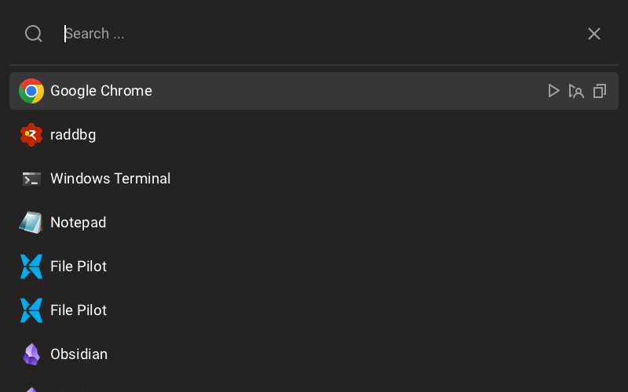

A simple tool for launching installed programs and opening files. Currently **Windows only**.
Simply press `Alt + Space` from any other application or desktop, to launch the search window.

Doesn't search the whole system, rather only programs and files from `Program Files`, `Desktop` and `Start Menu`.

## Running

Running the `.exe` directly without any arguments, will launch the application with a global keyboard hook.

Command line options:
- `--no-hook` to launch without a keyboard hook.

> [!IMPORTANT]
> It is recommneded to specify `--no-hook` argument when running using a **debugger**, since all the keyboard events from the OS go through the keyboard hook, and when the program is paused or stopped on a breakpoint, the keyboard hook can't process keyboard events, thus all of them will be delayed and the whole system will become barely responsive.

To toggle visualization of layout bounds and layout overflow press `F3`. (This is only available in debug and profiling builds).

## Building

`clang++` is needed for building.

Running the `scripts/build.bat` without any arguments builds the application in debug configuration. For release or profiling builds run with `release` or `profiling` as the first argument.

The keyboard hook is built separately by running `scripts/build_hook.bat`. Run `scripts/build_hook.bat release` to build the release configuration.

Also the vendor libraries are built separately by running `scripts/build_vendor.bat` or `scripts/build_vendor.bat release`.

## Profiling

The project relies on [Tracy](https://github.com/wolfpld/tracy) for profiling. Tracy is not required for running the `profiling` build, however it is needed to view the profiling data.
